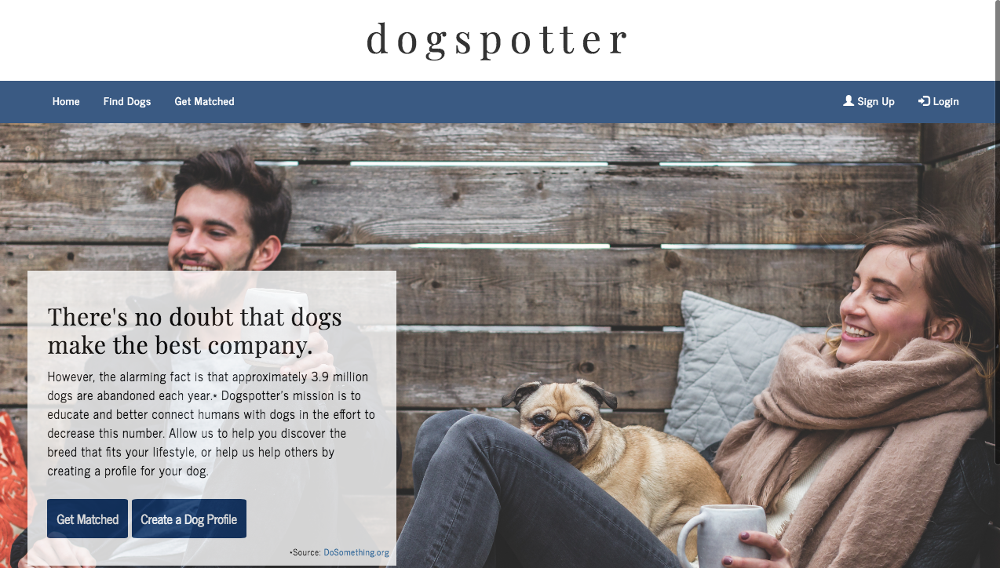
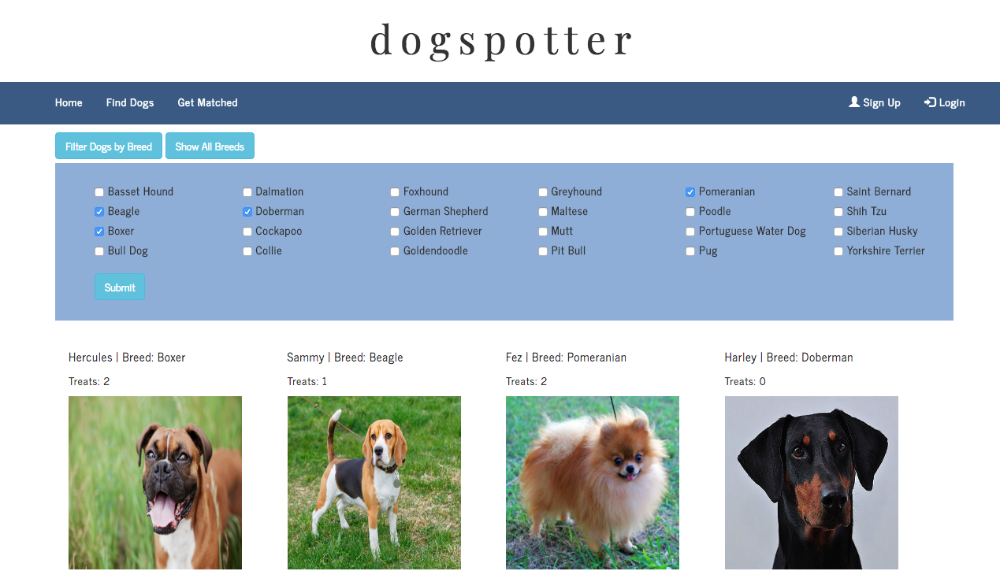
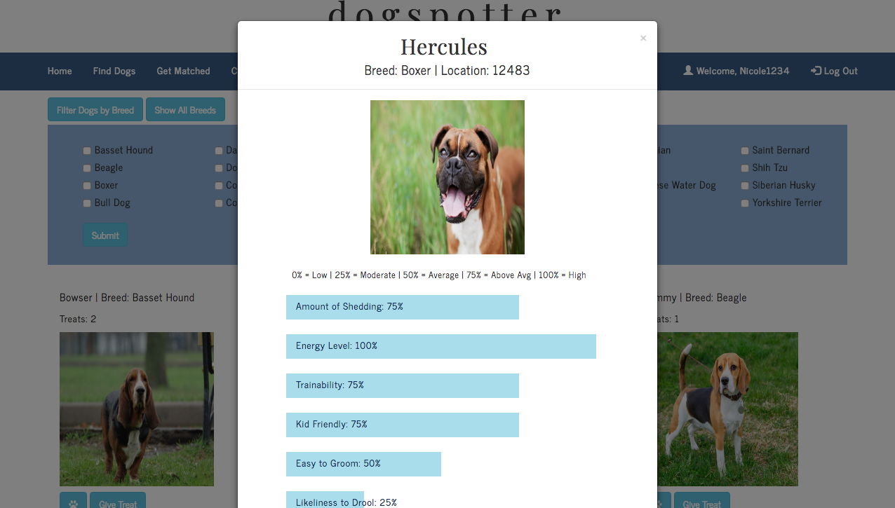
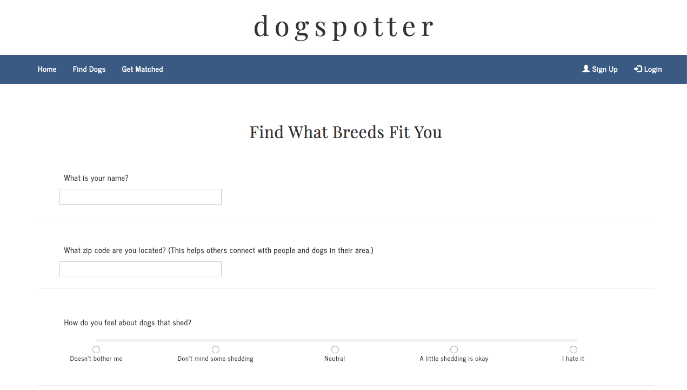
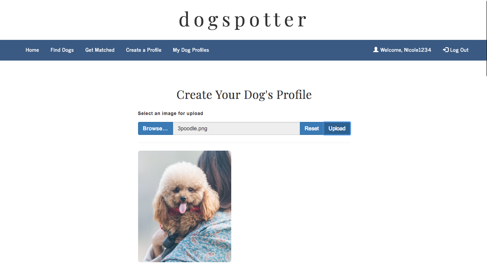

# Dogspotter

## Overview

A dynamic web application that serves as a resource for prospective dog owners and matching them to breeds that best fit their lifestyle. Users are able to search through the app to check out the characteristics of dogs that other users have posted. They can also "Get Matched" where they would answer a few questions and get matched to the dog that best fits their personality and lifestyle. Users can also post their dogs to contribute to the Dogspotter community. 

The app utilizes Handlebars.js for templating, Node.js for back-end, Express.js for routing, MySQL for saving data, and HTML, CSS and Bootstrap for the user interface.

## Utilizing the App

* View the app: [Heroku Link](http://dogspotter.herokuapp.com/)

- "Find Dogs": Search through the app to check out the characteristics of dogs that other users have posted. Click the paw print icon to view a dog's profile.
- "Give a Treat": Click the "Give a Treat" button to give a dog treats. A fun feature similar to Facebook's "Like" button. 
- "Get Matched": Answer a few questions to get matched to a dog that best fits your lifestyle.
- "Sign Up/Login": Create a sign up and login to be able to post a dog profile to the Dogspotter community to help grow our database and help prospective dog owners discover breeds that best fit their lifestyle. 

## Illustrations

### Home Page of Dogspotter:

### Find Dogs:

### Get Matched:

### Create a Dog Profile:

## Tech Used
- Node.js
- Express.js
- Handlebars.js
- MySQL
- Sequelize
- Npm packages
    - body-parser
    - express
    - express-handlebars
    - express-fileupload
    - express-session
    - passport
    - passport-local
    - bcrypt

## Built With

* Sublime Text - Text Editor

## Authors

* **Nicole Carvalho** - *Full-Stack Development* - [Nicole Carvalho](https://github.com/nicolelcarvalho)
* **Ray Templo** - *Full-Stack Development* - [Ray Templo](https://github.com/rtemplo)
* **Ryan Franco** - *Verification/Setting up passport* - [Ryan Franco](https://github.com/Rfranco92)
* **Chad Looker** - *Verification/Setting up passport* - [Chad Looker](https://github.com/CLooker)

